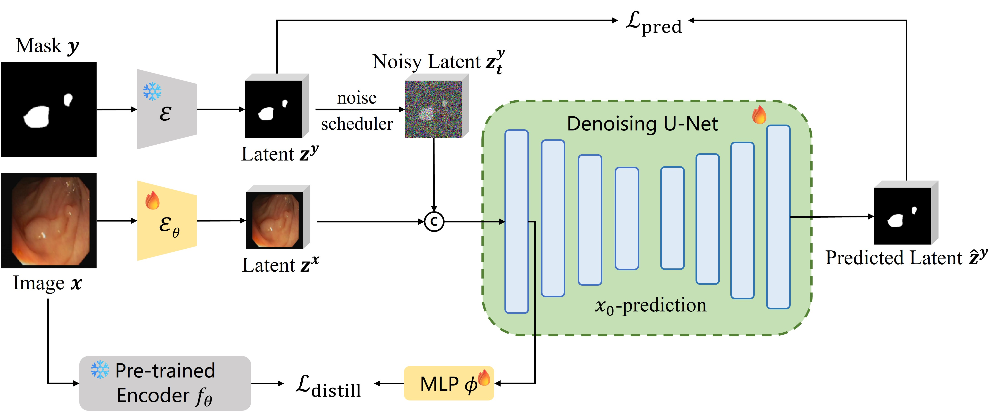

#  LEAF: Latent Diffusion with Efficient Encoder Distillation for Aligned Features in Medical Image Segmentation

[](https://leafseg.github.io/leaf/)
[](https://arxiv.org/abs/2507.18214)
[](https://huggingface.co/pearisli/LEAF-QaTa-COV19)

## LEAF Framework


## Performance


## Ablation


## Update
- **Oct 2025**: Release [LEAF-QaTa-COV19](https://huggingface.co/pearisli/LEAF-QaTa-COV19) model on huggingface

## Setup

1. Clone the repository:
```bash
git clone https://github.com/lispear/LEAF.git
cd LEAF-master
```

2. Install dependencies (requires conda):
```bash
conda create -n leaf python=3.11.11 -y
conda activate leaf
pip install -r requirements.txt 
```

## Training

1. Create assets directory:
```
mkdir assets
cd assets
```

2. Prepare pre-trained models:
- Download [U-Net](https://ommer-lab.com/files/latent-diffusion/lsun_churches.zip) and [VAE](https://ommer-lab.com/files/latent-diffusion/kl-f8.zip) and **extract weights**
```bash
unzip kl-f8.zip -d vae
unzip lsun_churches.zip -d unet
cd ..
python extract_weights.py
```

3. Run training script:
```bash
accelerate launch \
    --num_processes 1 \
    --num_machines 1 \
    --mixed_precision 'no' \
    --dynamo_backend 'no' \
    train.py --config config.yaml
```
